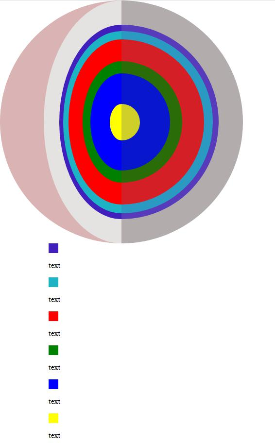

# aleksieiev-planet-diagram
Download as package from npm:
```npm i aleksieiev-planet-diagram```




To create your planet diagram you simply need to call only 3 functions.

First of all, define a parent for your Planet Diagram and Diagram Description.

Like this 
```const parent = document.getElementsByTagName('body')[0];```

Then define the diameter of your Planet Diagram. It will be the main constant for all math executions.

```
const parent = document.getElementsByTagName('body')[0];

const diameter = 500;
```

Now you need to create a container for Planet Diagram. There is five necessary arguments:
1) Planet diameter;
2) Container Parent(In which block of HTML your Planet Diagram will be pasted, if Parent has not only Planet Diagram as a child, Planet Diagram will be pasted as the last child of the Parent)
3) Color of shadowed part of your Planet Diagram;
4) Color of Left(mirrored) side of your diagram;
5) Color of the right side of your diagram;

*All colors must be in HEX(example: #ffffff)
```
const parent = document.getElementsByTagName('body')[0];

const diameter = 500; //only numeric value, not strings :)

createPlanetDiagramContainer(diameter, parent, '#dab4b4', '#e9e1e1', '#b3acac');
```
Then create your description block for diagram, with only one argument for parent(Not necessary to put Planet Diagram and Planet Description in the same Parent, but don't define PlanetDiagramContainer as Parent for the DescriptionContainer.):
```
const parent = document.getElementsByTagName('body')[0];

const diameter = 500;

createPlanetDiagramContainer(diameter, parent, '#dab4b4', '#e9e1e1', '#b3acac');

createDiscDescriptionContainer(parent);
```

Now let's create diagram discs for our container.
There are six necessary arguments for disc:
1) Planet Diameter(of Planet Diagram, which you have defined before)
2) Disc Diameter in relative for Planet Diameter value (from 0 to 0.8, example: 0.56)
3) Color of the Disc
4) Id
5) Diameter(or Width/Height)
6) Description text

```
const parent = document.getElementsByTagName('body')[0];

const diameter = 500;

createPlanetDiagramContainer(diameter, parent, '#dab4b4', '#e9e1e1', '#b3acac');

createDiscDescriptionContainer(parent);

createDisc(diameter, 0.8, '#411fbd', 1, 20, 'text');

createDisc(diameter, 0.75, '#1eb2c5', 2, 20, 'text');

createDisc(diameter, 0.68, 'red', 3, 20, 'text');

createDisc(diameter, 0.5, 'green', 4, 20, 'text');

createDisc(diameter, 0.4, 'blue', 5, 20, 'text');

createDisc(diameter, 0.15, 'yellow', 6, 20, 'text');
```
You can simply edit the style of your text and dots in disc description;
Done!
